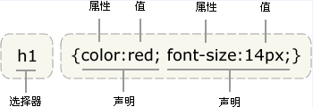
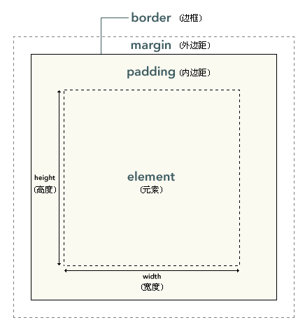

# HTML、CSS基础
# 1.HTML基础

本节来自：https://developer.mozilla.org/zh-CN/docs/Web/Guide/HTML/Introduction

&emsp;&emsp;当你在 web 浏览器中浏览网页时，你看到的最基本的内容是文字。这些文字一般有着一些样式特性，比如不同的文字大小和颜色。在多数情况下，页面还会展示图片或者还可能带有视频；有时候会有一个表单，你可以填写信息（或者搜索内容）；或者可以依据喜好自定义页面的展示效果；页面也经常会带有包含动画效果的内容；页面上有些内容会不断变化而有些内容会保持不变。

&emsp;&emsp;一些技术（如CSS，JavaScript，Flash，AJAX，JSON）可以用来定义网页中的一些元素。但是，网页的基础是由HTML（HyperText Markup Language 超文本标记语言）来定义的。没有了HTML，网页不可能存在。HTML是一个把所有东西包含起来的外壳：HTML是一个国际化的标准，由万维网联盟（W3C）和网页超文本技术工作小组 (WHATWG)维护。WHATWG认为HTML是一个“活着的标准”，它应该不断地在进化。而W3C则致力于维护HTML的“多个版本快照”，即当前最新的版本HTML5和HTML的进化版HTML 5.1。

&emsp;&emsp;HTML规范所定义的这种语言，既可以使用较为松散的HTML语法，也可以使用更为严格的XML（Extensible Markup Language 扩展标记语言）语法，同时也解决了Web应用的需求。HTML没有描述内容的样式和格式，只是内容本身和其意义。如果你想要在网站中加入样式和格式，需要通过层叠样式表（CSS）来定义和控制。


# 1.1HTML简史

&emsp;&emsp;蒂姆·伯纳斯-李，一名CERN（欧洲核子研究组织）的物理学家，在80年代后期设计了一种能在网路上分享文档的方式。在这之前，网路上沟通的方式仅限于纯文本传递，比如：电子邮件、FTP(文件传输协议)和Usenet讨论版。HTML是利用内容档案储存至中央服务器的方式，然后再将内容透过浏览器传递至本机工作站。 它简化了内容存取的方式，也让更多丰富内容能够显示（诸如较复杂的文本格式与图片的显示）。HTML 源自于SGML——它是一种复杂的文档结构定义和内容描述（文本或图像）语法；从HTML5起，HTML不再坚守SGML的语法。


# 1.2什么是HTML
&emsp;&emsp;HTML 是一种标记语言（markup language）。它告诉浏览器如何显示内容。HTML把内容（文字，图片，语言，影片等等）和「presentation」（这个内容是如何显示，比如文字用什么颜色显示等等）分开。HTML使用预先定义的元素集合来识别内容形态。 元素包含一个以上的标记来包含或者表达内容。标记利用尖括号表示，而结束标记（用来指示内容尾端）则在前面加上斜线。

举例来说，段落元素包含起始标记“<p>”和结束标记“</p>”。下面的例子展示一个包含HTML段落元素的段落


    <p>你开始学习HTML了.</p>

当此内容显示在网页浏览器中，它看起来会像这样：

    你开始学习HTML了 .


有一些元素是不能包含其他元素的，比如图片标签()，它只需要简单的指定文件名，作为他的一个属性即可。


> \

&emsp;&emsp;通常而言，尖括号括起的内容前面有斜线意味着一个标签的结束。这在HTML中是可选项，而在XHTML是必须的，包括XML模式下的HTML元素。

## 1.3元素——基本的构造区块

&emsp;&emsp;HTML由不同元素的集合组成。元素定义了它们所包含内容的语义。元素包含了两个相匹配的元素标签（tag）之中所有的内容，当然也包含了标签本身。例如，"<p>"标签表示一个段落的开始；"\"标签表示一张图片。

&emsp;&emsp;一些元素都有着明确的含义， 例如 ”这是一张图片”，“这是一个标题” 或者 “这是一个有序列表”。 另外一些则没这么特殊，例如 "这是本页面的一个节" 或者 "这是文本的一部分"，但是就技术层面上而言它们都是必不可少的，  例如标记一些在网页中不会被显示的内容。不论如何,所有的html元素都有其特定的语义及存在价值。

大部分的元素都支持元素嵌套，构成了一个层次结构。 一个简单的完整的网页结构例子如下所示：

```
<html>
  <body>

    <p>我的狗吃了所有的鳄梨酱.</p>

  </body>
</html>

```

&emsp;&emsp;显而易见, \<html> 元素将其他元素括起,\<body> 元素中包含网页内容。 该结构通常被视为由主干（\<html>）发展而来的具有分支(本例中分支为， 元素 \<body> 和\<p> )的树形结构。 该层次化结构称为 DOM: Document Object Model--文档对象模型。


## 1.4标签
&emsp;&emsp;HTML文档由纯文本表示。 你可以使用任意支持纯文本编写保存的文本编辑器来编写HTML文档，但大部分HTML程序员更倾向于使用专门的编辑器，这些编辑器支持语法高亮和DOM显示，例如Notepad++和sublime Text。 标签(Tag)的名字不区分大小写。 但是,W3C (维护了HTML标准的国际性性联盟)建议使用小写 ( XHTML 同样要求使用小写).

HTML 为由一对尖括号（<>）所括起来的内容赋予了特定含义. 这样的标识称为一个 标签（tag）. 例如:

> \<p>这是段落中的文本。\</p>

&emsp;&emsp;上述例子中有一个起始标签（start tag）和一个结束标签（end tag）。结束标签与起始标签在内容上是一样的，但结束标签会在小于符号（<）后多一个整斜线/。 大多数 HTML 元素由一个起始标签和一个结束标签标识。起始标签和结束标签应成对出现，也就是说在一个起始标签之后应有其对应的结束标签。  由连个标签（起始标签和结束标签）构成的元素而言，缺少其中之一，这个元素都可能会被认为是无效的。

注释：开始标签常被称为开放标签（opening tag），结束标签常称为闭合标签（closing tag)

有效代码示例:
> \<em>我\<strong>真的\</strong>是这个意思\</em>.

无效代码示例:
> 无效: \<em>我\<strong>真的\</em>是这个意思\</strong>.

有效实例代码里的em的结束标签写在它内嵌标签strong的结束标签之后。

有些元素没有包含文本内容或者其他元素，这称为空元素。它们没有结束标签，请看下面例子:

> \

一般在结束标签后面空格加上个斜杠（这在XHTML是必需的）

> \

而在HTML就没这么严格的规定，加上斜杠只是好看点而已，没什么作用

## 1.5 属性
开始标签可能包含一些信息，这些信息叫做元素的特性，包括两部分:
- 特性名
- 特性值

一些元素可以只有特性名没有特性值。它们的特性名类似“是否”，“有或没有”，所以可以省略特性值，所以下面三种写法都是一样的意思:

```
<input required="required">

<input required="">

<input required>
```

&emsp;&emsp;特性值如果有包含空格就要用引号，单双引号都可以。如果特性值是单个词就可以不用引号，但为了避免出错和易于识别一般会加上引号:

> \<p class=foo bar> （当心，这可能不意味着你想象的意思。）

上面的例子就是没加引号，浏览器错误地解析成下面的:

> \<p class="foo" bar="">

## 1.6 命名字符参考

&emsp;&emsp;命名字符参考 (一般被称作实体) 用于表示在HTML中具有特定含义的字符. 举例说，HTML将“>”和“<”符号理解为标签分隔符。所以，当你想在文本中用">"符号表达“大于”的含义时，你可以使用命名字符参考来作为替代。 以下例举了四个非常重要的常用实体：


- &gt; 表示大于符号">" (>)
- &lt; 表示小于符号"<" (<)
- &amp; 表示和符号"and"(&)
- &quot; 表示引用符号" (")

&emsp;&emsp;除这四个外，还有许多其他的实体符号,但以上所举的例子是实体符号中最为重要的几个，原因在于他们所表示的原本字符在HTML中具有特定的含义。（即是说，如果你没有在HTML文本中使用实体符号来替代原本符号的话，浏览器可能会错误地理解你的意图。）


## 1.7 文档类型和注释

&emsp;&emsp;除标签，文本内容和实体外，一个HTML文档一定需要在第一行做出文档类型声明(doctype declaration)。在现代HTML中，这句声明书写如下：

> \<!DOCTYPE html>

&emsp;&emsp;文档类型声明的演变有着复杂深长的历史，但今天的我们只需知道上方的文档类型声明告诉了浏览器需要遵循W3C标准来解析HTML和CSS代码，且不必尝试去模拟90年代的IE环境。（参见quirks mode）

&emsp;&emsp;HTML拥有一个允许我们在HTML文档添加注释的机制。注释并不会在浏览器渲染页面时一并呈现给用户，而是隐藏在源代码内。这个机制使我们能十分方便地为HTML文档的某个部分添加注释信息、给你的同事预留便笺、或者给你自己做个提示。HTML注释被如下符号封闭：

> \<!-- 这是评论文本 -->


# 2.CSS基础
本节来自于：http://www.w3school.com.cn/css/index.asp

&emsp;&emsp;Cascading Style Sheets (CSS) 是一门指定文档该如何呈现给用户的语言。
它可以用来描述那些使用诸如 HTML、SVG、XML等标记语言编写的文档的样式。CSS 描述了这些具有层次结构的文档中的每个元素是如何呈现在屏幕，纸张，朗读器等其它输出设备上的。根据不同的输出设备可以让同一个文档展现不同的样式，这也是 CSS 这门语言的重要特征。

没有CSS的XML文档：https://fruitsandwich.github.io/webTraining/lession02/doc.xml

带有CSS的XML文档：https://fruitsandwich.github.io/webTraining/lession02/docWithStyle.xml
## 2.1 CSS简介

- CSS 指层叠样式表 (Cascading Style Sheets)
- 样式定义如何显示元素
- 样式通常存储在样式表中
- 把样式添加到 HTML中，是为了解决内容与表现分离的问题
- 外部样式表可以极大提高工作效率
- 外部样式表通常存储在 CSS 文件中
- 多个样式定义可层叠为一

> 层叠——简单的说，层叠就是对一个元素多次设置同一个样式，这将使用最后一次设置的属性值。


## 2.2 CSS基础语法

CSS 规则由两个主要的部分构成：选择器，以及一条或多条声明。
> selector {declaration1; declaration2; ... declarationN }

选择器通常是您需要改变样式的 HTML 元素。

每条声明由一个属性和一个值组成。

属性（property）是您希望设置的样式属性（style attribute）。每个属性有一个值。属性和值被冒号分开。

> selector {property: value}

下面这行代码的作用是将 h1 元素内的文字颜色定义为红色，同时将字体大小设置为 14 像素。
在这个例子中，h1 是选择器，color 和 font-size 是属性，red 和 14px 是值。

> h1 {color:red; font-size:14px;}

下面的示意图为您展示了上面这段代码的结构：



---

提示：如果值为若干单词，则要给值加引号：

> p {font-family: "sans serif";}

---

选择器的分组

&emsp;&emsp;你可以对选择器进行分组，这样，被分组的选择器就可以分享相同的声明。用逗号将需要分组的选择器分开。在下面的例子中，我们对所有的标题元素进行了分组。所有的标题元素都是绿色的。

```
h1,h2,h3,h4,h5,h6 {
  color: green;
}
```

## 2.3 层叠和继承
&emsp;&emsp;一个元素的样式，可以通过多种方式来定义，而多种定义方式之间通过复杂的影响关系决定了元素的最终样式。这种复杂既造就了CSS的强大，也导致CSS显得如此“混乱”而且难以调试。

对于层叠来说，共有三种主要的样式来源：

- 浏览器对HTML定义的默认样式。
- 用户定义的样式。
- 开发者定义的样式，可以有三种形式：
  - 定义在外部文件（外链样式）：一般都是通过这种形式定义样式。
  - 在页面的头部定义（内联样式）：通过这种形式定义的样式只在当前页面内生效。
  - 定义在特定的元素身上（行内样式）：这种形式多用于测试，可维护性较差。

&emsp;&emsp;用户定义的样式表会覆盖浏览器定义的默认样式，然后网页开发者定义的样式又会覆盖用户样式。一般网页的开发者只需要关注开发者样式。

---
&emsp;&emsp;所谓css的继承是指被包在内部的标签将拥有外部标签的样式性质，它是依赖于祖先-后代的关系的。继承是一种机制，它允许样式不仅可以应用于某个特定的元素，还可以应用于它的后代。例如一个body定义了的颜色值也会应用到段落的文本中。
```
body{color:red;}

<p>css的<strong>层叠和继承</strong>深入探讨</p>
```

这段代码的应用结果是：“css的层叠和继承深入探讨”这段话是红颜色的，“层叠和继承”由于应用了strong元素，所以是粗体。

## 2.4 选择器
- 标签选择器
- 类选择器
- id选择器
- 属性选择器
- 伪类选择器
- 基于关系的选择器

---
标签选择器

&emsp;&emsp;标签选择器是最常见的 CSS选择器也叫元素选择器。换句话说，文档的元素就是最基本的选择器。
如果设置 HTML 的样式，选择器通常将是某个 HTML 元素，比如 p、h1、em、a，甚至可以是 html 本身：

```
html {color:black;}
h1 {color:blue;}
h2 {color:silver;}
```

---
类选择器

&emsp;&emsp;通过设置元素的 class 属性，可以为元素指定类名。类名由开发者自己指定。 文档中的多个元素可以拥有同一个类名。在写样式表时，类选择器是以英文句号（.）开头的。

```
<p class="important">
This paragraph is very important.
</p>

.important {color:red;}
```
&emsp;&emsp;在HTML中class值中可能有多个，各个词之间用空格分隔。例如，如果希望将一个特定的元素同时标记为重要（important）和警告（warning），就可以写作：
```
<p class="important warning"> <!--  这两个词的顺序无关紧要，写成 warning important 也可以。 -->
This paragraph is a very important warning.
</p>

.important {font-weight:bold;}  /* class 为 important 的所有元素都是粗体 */
.warning {font-style:italic;}   /* class 为 warning 的所有元素为斜体 */
.important.warning {background:silver;} /* class 中同时包含 important 和 warning 的所有元素还有一个银色的背景 */
```

---
id选择器

&emsp;&emsp;通过设置元素的id属性为该元素制定id。id名由开发者指定。**每个id在文档中必须是唯一的**。在写样式表时，id选择器是以#开头的。

```
<p id="intro">This is a paragraph of introduction.</p>

#intro {font-weight:bold;}
```

---
属性选择器

&emsp;&emsp;如果希望选择有某个属性的元素，而不论元素是什么，可以使用简单属性选择器。

```
*[title] {color:red;} *号表示统配所有元素
```
&emsp;&emsp;属性选择器还可以和前面几个选择器组合使用来更精确的匹配

```
a[href] {color:red;} 选择有href属性的a元素
input[type='button'] {color:red;} 选择type为button的input元素
```

选择器  | 描述 
---|---
[attribute] | 用于选取带有指定属性的元素
[attribute=value] | 用于选取带有指定属性和值的元素。
[attribute~=value] |用于选取属性值中包含指定词汇的元素。
[attribute\|=value] |用于选取带有以指定值开头的属性值的元素，该值必须是整个单词。
[attribute^=value]|	匹配属性值以指定值开头的每个元素。
[attribute$=value]|	匹配属性值以指定值结尾的每个元素。
[attribute*=value]|	匹配属性值中包含指定值的每个元素。


---
伪类选择器

&emsp;&emsp;CSS伪类（pseudo-class）是加在选择器后面的用来指定元素状态的关键字。比如，:hover 会在鼠标悬停在选中元素上时应用相应的样式。

&emsp;&emsp;伪类和伪元素（pseudo-elements）不仅可以让你为符合某种文档树结构的元素指定样式，还可以为符合某些外部条件的元素指定样式：浏览历史(比如是否访问过 (:visited)， 内容状态(如 :checked ), 鼠标位置 (如:hover). 

```
selector:pseudo-class {
  property: value;
}
```
伪类列表
- :link
- :visited
- :active
- :hover
- :focus
- :first-child
- :nth-child
- :nth-last-child
- :nth-of-type
- :first-of-type
- :last-of-type
- :empty
- :target
- :checked
- :enabled
- :disabled


```
a:link {color: #FF0000}		/* 未访问的链接 */
a:visited {color: #00FF00}	/* 已访问的链接 */
a:hover {color: #FF00FF}	/* 鼠标移动到链接上 */
a:active {color: #0000FF}	/* 选定的链接 */
```


---
基于关系的选择器

CSS还有多种基于元素关系的选择器。通过它们你可以更精确的选择元素。

常见的基于关系的选择器


选择器 |	选择的元素
---|---
A E |	元素A的任一后代元素E (后代节点指A的子节点，子节点的子节点，以此类推)
A > E |	元素A的任一子元素E(也就是直系后代)
E:first-child |	任一是其父母结点的第一个子节点的元素E
B + E |	元素B的任一下一个兄弟元素E
B ~ E |	B元素后面的拥有共同父元素的兄弟元素E

你可以任意组合以表达更复杂的关系。


```
例:
一个HTML表格有id 属性，但是它的行和单元格没有单独的id:
<table id="data-table-1">
<tr>
<td>Prefix</td>
<td>0001</td>
<td>default</td>
</tr>
</table>

下面的规则使表格每行的第一个单元格字体为粗体，使第二个单元格使用等宽字体。这条规则只影响id为data-table-1的表格:
#data-table-1 td:first-child {font-weight: bolder;}
#data-table-1 td:first-child + td {font-family: monospace;}

```

## 2.5 盒模型
&emsp;&emsp;当你的浏览器展现一个元素时，这个元素会占据一定的空间。这个空间由四部分组成。中间是元素呈现内容的区域。这个区域的外面是内边距。再外面是边框。最外面的是外边距，外边距将该元素与其它元素分开。



&emsp;&emsp;元素框的最内部分是实际的内容，直接包围内容的是内边距。内边距呈现了元素的背景。内边距的边缘是边框。边框以外是外边距，外边距默认是透明的，因此不会遮挡其后的任何元素。

&emsp;&emsp;内边距、边框和外边距都是可选的，默认值是零。但是，许多元素将由用户代理样式表设置外边距和内边距。可以通过将元素的 margin 和 padding 设置为零来覆盖这些浏览器样式。这可以分别进行，也可以使用通用选择器对所有元素进行设置：

```
* {
  margin: 0;
  padding: 0;
}
```
&emsp;&emsp;假设框的每个边上有 10 个像素的外边距和 5 个像素的内边距。如果希望这个元素框达到 100 个像素，就需要将内容的宽度设置为 70 像素，请看下图：


```
#box {
  width: 70px;
  margin: 10px;
  padding: 5px;
}
```

&emsp;&emsp;这里分别有左右外边距都是10px，左右内填充都是5px，一共有（10 +5 ）* 2 = 30px的非内容宽度加上元素自身70px正好让元素框为100px。


# 3.实验

- 在IDE中新建一个HTML模板，观察IDE提供的HTML模板中有哪些HTML元素
- 学习MDN CSS入门教程：https://developer.mozilla.org/zh-CN/docs/Web/Guide/CSS/Getting_started
- 选择你喜欢的一个事物（可以是风景、物品、人或其他虚拟概念）写一个HTML页面来介绍ta。

要求：

1. 要有段落
2. 要有图片
3. 定义两套CSS使HTML页中的文字、段落、图片等元素样式有两套不同的呈现
