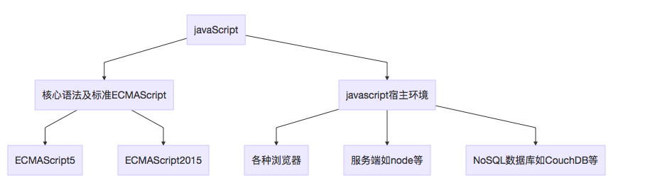
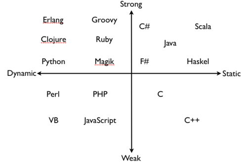
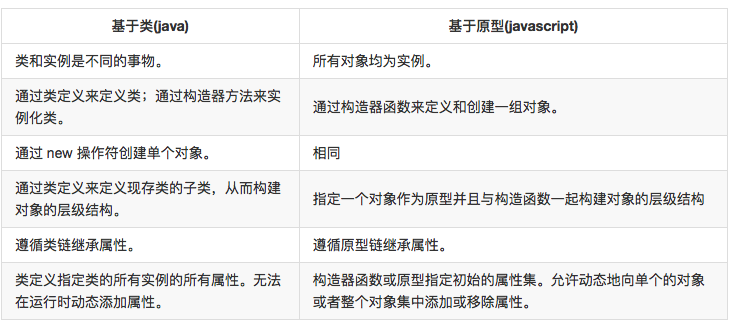

# javascript介绍及基本概念
> JavaScript是一种轻量级的脚本语言。所谓“脚本语言”，指的是它不具备开发操作系统的能力，而是只用来编写控制其他大型应用程序的“脚本”。

## 1.简介
 &emsp;&emsp;JavaScript 堪称[世界上被人误解最深的编程语言](http://javascript.crockford.com/javascript.html)。虽然常被嘲为“玩具语言”，但在它看似简洁的外衣下，还隐藏着强大的语言特性。 JavaScript 目前广泛应用于众多知名应用中，对于网页和移动开发者来说，JavaScript十分重要。

 &emsp;&emsp;JavaScript是一种嵌入式（embedded）语言。它本身提供的核心语法，规模相当小，只能用来做一些数学和逻辑运算。JavaScript本身不提供任何与I/O（输入/输出）相关的API，都要靠宿主环境（host）提供，任何与外界沟通的机制都是由宿主环境提供的。

 &emsp;&emsp;浏览器是最常见的宿主环境，但在非常多的其他程序中也包含 JavaScript 解释器，如 Adobe Acrobat、Photoshop、SVG 图像、Yahoo! 的 Widget 引擎，以及 Node.js 之类的服务器端环境。JavaScript 的实际应用远不止这些，除此之外还有 NoSQL 数据库（如开源的 Apache CouchDB）、嵌入式计算机，以及包括 GNOME （注：GNU/Linux 上最流行的 GUI 之一）在内的桌面环境等等。

## 2.javascript的诞生

> 以下两节的介绍源自阮一峰的[JavaScript 标准参考教程（alpha）](http://javascript.ruanyifeng.com/)

&emsp;&emsp;JavaScript因为互联网而生，紧随着浏览器的出现而问世。回顾它的历史，就要从浏览器的历史讲起。

1992年底，美国国家超级电脑应用中心（NCSA）开始开发一个独立的浏览器，叫做Mosaic。这是人类历史上第一个浏览器，从此网页可以在图形界面的窗口浏览。

1994年10月，NCSA的一个主要程序员Marc Andreessen联合风险投资家Jim Clark，成立了Mosaic通信公司（Mosaic Communications），不久后改名为Netscape。这家公司的方向，就是在Mosaic的基础上，开发面向普通用户的新一代的浏览器Netscape Navigator。

1994年12月，Navigator发布了1.0版，市场份额一举超过90%。

Netscape公司很快发现，Navigator浏览器需要一种可以嵌入网页的脚本语言，用来控制浏览器行为。当时，网速很慢而且上网费很贵，有些操作不宜在服务器端完成。比如，如果用户忘记填写“用户名”，就点了“发送”按钮，到服务器再发现这一点就有点太晚了，最好能在用户发出数据之前，就告诉用户“请填写用户名”。这就需要在网页中嵌入小程序，让浏览器检查每一栏是否都填写了。

管理层对这种浏览器脚本语言的设想是：功能不需要太强，语法较为简单，容易学习和部署。那一年，正逢Sun公司的Oak语言更名为Java，市场大肆宣传“一次编写到处运行（Write Once，Run Anywhere）”推广的非常成功。Netscape公司决定与Sun公司合作，浏览器支持嵌入Java小程序（后来称为Java applet）。但是，浏览器脚本语言是否就选用Java，则存在争论。后来，还是决定不使用Java，因为网页小程序不需要Java这么“重”的语法。但是，同时也决定脚本语言的语法要接近Java，并且可以支持Java程序。这些设想直接排除了使用现存语言，比如Perl、Python和TCL。

1995年，Netscape公司雇佣了程序员[Brendan Eich 布兰登·艾奇](http://baike.baidu.com/link?url=10XqsIln8036csdf1XujKzmBxoBRYoKQXxNfdHZFKoF6OHSDV4ljBeq68jkmLawE-LjtfuNahL58_kwwwgy_YfTbOnfk01ieJZdadcLeD-C)开发这种网页脚本语言。Brendan Eich有很强的函数式编程背景，希望以Scheme语言（函数式语言鼻祖LISP语言的一种方言）为蓝本，实现这种新语言。

1995年5月，Brendan Eich只用了10天，就设计完成了这种语言的第一版。它是一个大杂烩，语法有多个来源：

- 基本语法：借鉴C语言和Java语言。
- 数据结构：借鉴Java语言，包括将值分成原始值和对象两大类。
- 函数的用法：借鉴Scheme语言和Awk语言，将函数当作第一等公民，并引入闭包。
- 原型继承模型：借鉴Self语言（Smalltalk的一种变种）。
- 正则表达式：借鉴Perl语言。
- 字符串和数组处理：借鉴Python语言。

为了保持简单，这种脚本语言缺少一些关键的功能，比如块级作用域、模块、子类型（subtyping）等等，但是可以利用现有功能找出解决办法。这种功能的不足，直接导致了后来JavaScript的一个显著特点：对于其他语言，你需要学习语言的各种功能，而对于JavaScript，你常常需要学习各种解决问题的模式。而且由于来源多样，从一开始就注定，JavaScript的编程风格是函数式编程和面向对象编程的一种混合体。

Netscape公司的这种浏览器脚本语言，最初名字叫做Mocha，1995年9月改为LiveScript。12月，Netscape公司与Sun公司（Java语言的发明者和所有者）达成协议，后者允许将这种语言叫做JavaScript。这样一来，Netscape公司可以借助Java语言的声势，而Sun公司则将自己的影响力扩展到了浏览器。

之所以起这个名字，并不是因为JavaScript本身与Java语言有多么深的关系（事实上，两者关系并不深），而是因为Netscape公司已经决定，使用Java语言开发网络应用程序，JavaScript可以像胶水一样，将各个部分连接起来。当然，后来的历史是Java语言的浏览器插件失败了，JavaScript反而发扬光大。

1995年12月4日，Netscape公司与Sun公司联合发布了JavaScript语言。

1996年3月，Navigator 2.0浏览器正式内置了JavaScript脚本语言。

## 3.javascript的历史变迁和ECMAScript

Netscape推出javascript的几个月之后，微软模仿JavaScript开发了一种相近的语言，取名为JScript（JavaScript是Netscape的注册商标，微软不能用），首先内置于IE 3.0。Netscape公司面临丧失浏览器脚本语言的主导权的局面。

1996年11月，Netscape公司决定将JavaScript提交给国际标准化组织ECMA（European Computer Manufacturers Association），希望JavaScript能够成为国际标准，以此抵抗微软。ECMA的39号技术委员会（Technical Committee 39）负责制定和审核这个标准，成员由业内的大公司派出的工程师组成，目前共25个人。该委员会定期开会，所有的邮件讨论和会议记录，都是公开的。

1997年7月，ECMA组织发布262号标准文件（ECMA-262）的第一版，规定了浏览器脚本语言的标准，并将这种语言称为ECMAScript。这个版本就是ECMAScript 1.0版。之所以不叫JavaScript，一方面是由于商标的关系，Java是Sun公司的商标，根据一份授权协议，只有Netscape公司可以合法地使用JavaScript这个名字，且JavaScript已经被Netscape公司注册为商标，另一方面也是想体现这门语言的制定者是ECMA，不是Netscape，这样有利于保证这门语言的开放性和中立性。因此，ECMAScript和JavaScript的关系是，前者是后者的规格，后者是前者的一种实现。在日常场合，这两个词是可以互换的。

ECMAScript只用来标准化JavaScript这种语言的基本语法结构，与部署环境相关的标准都由其他标准规定，比如DOM的标准就是由W3C组织（World Wide Web Consortium）制定的。

ECMA-262标准后来也被另一个国际标准化组织ISO（International Organization for Standardization）批准，标准号是ISO-16262。

javascript标准化后的版本变迁
---

1997年7月，ECMAScript 1.0发布。

1998年6月，ECMAScript 2.0版发布。

1999年12月，ECMAScript 3.0版发布，成为JavaScript的通行标准，得到了广泛支持。

2007年10月，ECMAScript 4.0版草案发布，对3.0版做了大幅升级，预计次年8月发布正式版本。草案发布后，由于4.0版的目标过于激进，各方对于是否通过这个标准，发生了严重分歧。以Yahoo、Microsoft、Google为首的大公司，反对JavaScript的大幅升级，主张小幅改动；以JavaScript创造者Brendan Eich为首的Mozilla公司，则坚持当前的草案。

2008年7月，由于对于下一个版本应该包括哪些功能，各方分歧太大，争论过于激进，ECMA开会决定，中止ECMAScript 4.0的开发（即废除了这个版本），将其中涉及现有功能改善的一小部分，发布为ECMAScript 3.1，而将其他激进的设想扩大范围，放入以后的版本，由于会议的气氛，该版本的项目代号起名为Harmony（和谐）。会后不久，ECMAScript 3.1就改名为ECMAScript 5。

>ECMAScript 第四版草案由于太过激进而被抛弃，Adobe 的ActionScript 3.0是 ECMAScript edition 4 的唯一实现（ Flash 差点就统一 Web 了）

2009年12月，ECMAScript 5.0版正式发布。Harmony项目则一分为二，一些较为可行的设想定名为JavaScript.next继续开发，后来演变成ECMAScript 6；一些不是很成熟的设想，则被视为JavaScript.next.next，在更远的将来再考虑推出。TC39的总体考虑是，ECMAScript 5与ECMAScript 3基本保持兼容，较大的语法修正和新功能加入，将由JavaScript.next完成。当时，JavaScript.next指的是ECMAScript 6。第六版发布以后，将指ECMAScript 7。TC39预计，ECMAScript 5会在2013年的年中成为JavaScript开发的主流标准，并在此后五年中一直保持这个位置。

2011年6月，ECMAscript 5.1版发布，并且成为ISO国际标准（ISO/IEC 16262:2011）。到了2012年底，所有主要浏览器都支持ECMAScript 5.1版的全部功能。

2013年3月，ECMAScript 6草案冻结，不再添加新功能。新的功能设想将被放到ECMAScript 7。

2013年12月，ECMAScript 6草案发布。然后是12个月的讨论期，听取各方反馈。

2015年6月，ECMAScript 6正式发布，并且更名为“ECMAScript 2015”。这是因为TC39委员会计划，以后每年发布一个ECMAScirpt的版本。

2016年6月，《ECMAScript 2016 标准》发布。与前一年发布的版本相比，它只增加了两个较小的特性。

## 4 javascript和其他主流编程语言的区别
### 4.1 解释型

  C、C++等需要通过编译器（compiler）将源代码编译成机器码，之后才能执行的语言。一般需经过编译（compile）、链接（linker）这两个步骤。编译是把源代码编译成机器码，链接是把各个模块的机器码和依赖库串连起来生成可执行文件。

  Java、C#是半编译半解释型语言，先编译成中间码再由虚拟机或运行库执行。

  JavaScript语言是完全解释性语言。不需要编译，在运行时由解释器直接执行。

### 4.2 动态类型

  Java、C、C++是静态类型语言。数据类型是在编译期进行检查的，也就是说变量在使用前要声明变量的数据类型，这样的好处是把类型检查放在编译期，提前检查可能出现的类型错误。

  javascript是动态类型语言。在运行期进行类型检查的语言，也就是在编写代码的时候可以不指定变量的数据类型。

### 4.3 弱类型

  Java、C#等是强类型语言。一个变量不经过强制转换，它永远是这个数据类型，不允许隐式的类型转换。举个例子：如果你定义了一个double类型变量a,不经过强制类型转换那么程序int b = a无法通过编译。

  javascript是弱类型语言。允许编译器进行隐式的类型转换。这一点C、C++也是如此。

  

### 4.4 基于原型的面向对象

  Java、C++和C#是基于类的面向对象语言，是构建在两个不同实体的概念之上的：类和实例。

  - 类（class）：定义了所有用于具有某一组特征对象的属性（可以将 Java 中的方法和变量以及 C++ 中的成员都视作属性）。类是抽象的事物，而不是其所描述的全部对象中的任何特定的个体。例如 Employee 类可以用来表示所有雇员的集合。
  - 实例（instance）：类的实例化体现；或者说，是类的一个成员。例如， Victoria 可以是 Employee 类的一个实例，表示一个特定的雇员个体。实例具有和其父类完全一致的属性。

  javascript有基于原型的面向对象概念，并没有类和实例的区别它只有对象。

  基于原型的语言具有所谓原型对象（prototypical object）的概念。原型对象可以作为一个模板，新对象可以从中获得原始的属性。任何对象都可以指定其自身的属性，既可以是创建时也可以在运行时创建。而且，任何对象都可以作为另一个对象的原型（prototype），从而允许后者共享前者的属性。

  

### 4.5 把函数作为“第一等公民”

  在C、C++、Java、C#中，函数都是作为一个二等公民存在，只能用语言的关键字声明一个函数然后调用它，如果需要把函数作为参数传给另一个函数，或是赋值给一个本地变量，又或是作为返回值，就需要通过函数指针(function pointer)、代理(delegate)等特殊的方式周折一番。

  而在JavaScript世界中函数却是一等公民，它不仅拥有一切传统函数的使用方式（声明和调用），而且可以做到像简单值一样赋值、传参、返回，这样的函数也称之为第一级函数（[First-class Function](https://en.wikipedia.org/wiki/First-class_function)）。不仅如此，JavaScript中的函数还充当了类的构造函数的作用，同时又是一个Function类的实例(instance)。这样的多重身份让JavaScript的函数变得非常重要。

  javascript把函数作为“第一等公民”使得javascript开发可以使用“函数式编程”范式。

  关于函数式编程可以参考：
  - 阮一峰：[函数式编程初探](http://www.ruanyifeng.com/blog/2012/04/functional_programming.html)
  - Franklin Risby:[JS函数式编程指南](https://llh911001.gitbooks.io/mostly-adequate-guide-chinese/content/)

## 5 javascript单线程、异步和event loop
javascript的单线程和异步特性在编写javascript程序过程中是非常重要的概念。异步特性与函数式构成了javascript程序的主要风格。
### 5.1javascript单线程
JavaScript语言的一大特点就是单线程，也就是说，同一个时间只能做一件事。

JavaScript的单线程，与它的用途有关。作为浏览器脚本语言，JavaScript的主要用途是与用户互动，以及操作DOM。这决定了它只能是单线程，否则会带来很复杂的同步问题。比如，假定JavaScript同时有两个线程，一个线程在某个DOM节点上添加内容，另一个线程删除了这个节点，这时浏览器应该以哪个线程为准？

所以，为了避免复杂性，从一诞生，JavaScript就是单线程，这已经成了这门语言的核心特征，将来也不会改变。

为了利用多核CPU的计算能力，HTML5提出Web Worker标准，允许JavaScript脚本创建多个线程，但是子线程完全受主线程控制，且不得操作DOM。所以，这个新标准并没有改变JavaScript单线程的本质。
### 5.2同步和异步
一般而言，对程序的调用分为发出调用和得到结果两步，根据如何得到结果调用被分为两种形式。
- 同步：就是在发出一个功能调用时，在没有得到结果之前，该调用就不返回。也就是必须一件一件事做,等前一件做完了才能做下一件事.
- 异步：当一个异步过程调用发出后，调用者不能立刻得到结果。实际处理这个调用的部件在完成后，通过一系列的手段才最终拿到结果（状态、通知和回调等）。

例子[https://fruitsandwich.github.io/webTraining/lession03/asynchronous.html](https://fruitsandwich.github.io/webTraining/lession03/asynchronous.html)

### 5.3event loop
JavaScript是单线程的，但javascript如何利用单线程来实现所谓的异步，其中有个很重要的概念：事件循环(Event Loop)。

关于event loop，有不少文章从很深的角度讨论了，比如：
- 阮一峰:[JavaScript 运行机制详解：再谈Event Loop](http://www.ruanyifeng.com/blog/2014/10/event-loop.html)
- 朴灵对阮一峰上篇文章的批注：[朴灵批注](http://blog.csdn.net/lin_credible/article/details/40143961)
- [JavaScript 事件循环（译文JavaScript Event Loop）](https://segmentfault.com/a/1190000006811224?utm_source=tuicool&utm_medium=referral)
